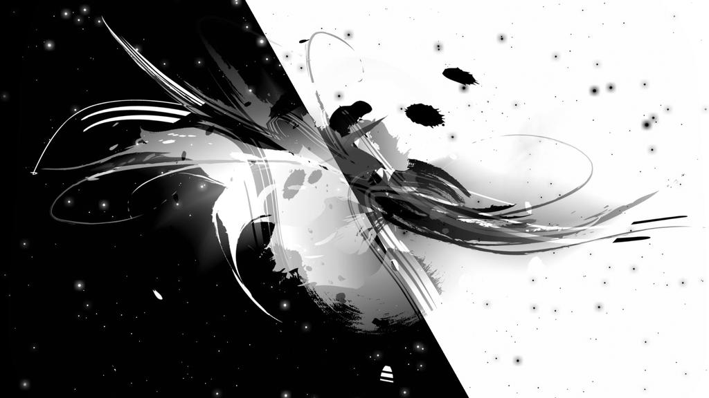

<h1 align="center">UNITY PONG [2D]</h1>

Pong, one of the earliest and most iconic arcade video games, makes a comeback in this Unity 2022 2D recreation.  Originally released in 1972 by Atari, Pong's simple table tennis-themed gameplay and two-dimensional graphics captivated players. Recapture the nostalgia of this classic while exploring the power of Unity's 2D tools.

### ✨FEATURES✨
* Basic AI
* UI
* Physics
* 2D Graphics
* Sound Effects

